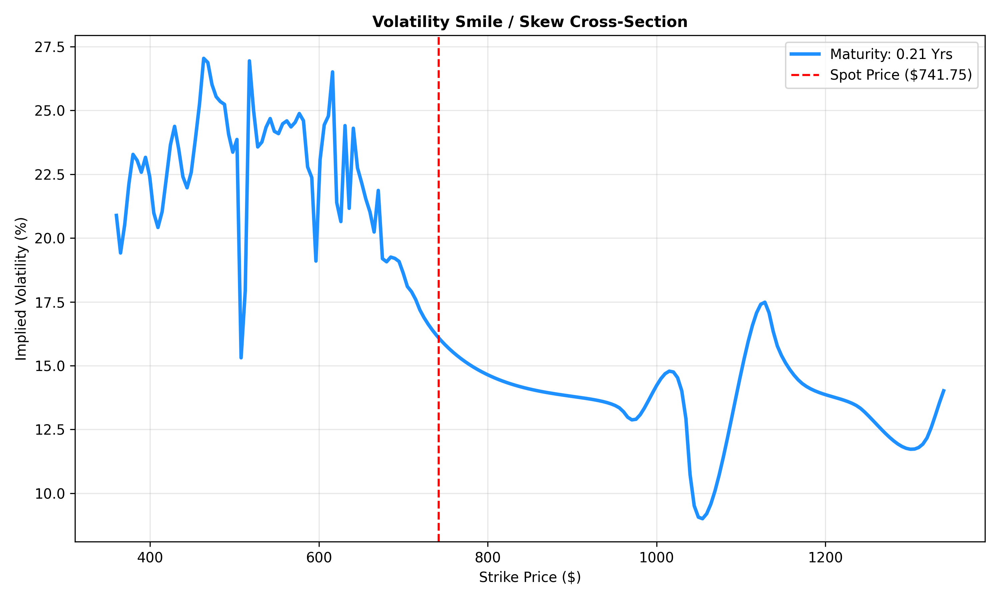

# Volatility Surface Project

A quantitative finance application that constructs an implied volatility surface from live options market data using the Black-Scholes-Merton model, Newton-Raphson implied volatility inversion, and Radial Basis Function (RBF) interpolation.

## Live Interactive Demo

Explore the interactive 3D volatility surface:

**https://droop0045-star.github.io/Volatility-Surface-Name/volatility_surface.html**

---

## Project Overview

This project fetches real-time options market data, computes implied volatilities from observed option prices, and builds a smooth volatility surface across strike prices and maturities.

The implementation combines quantitative finance, numerical optimization, scientific computing, and interactive data visualization.

### Key Concepts

* Black-Scholes-Merton Option Pricing
* Implied Volatility Estimation
* Newton-Raphson Root Finding
* Volatility Smile & Volatility Skew
* Term Structure of Volatility
* Radial Basis Function (RBF) Interpolation
* Interactive Financial Visualization

---

## Results

### Volatility Smile



### Interactive 3D Volatility Surface

View the fully interactive surface:

**https://droop0045-star.github.io/Volatility-Surface-Name/volatility_surface.html**

*(Add a screenshot named `volatility_surface.png` and uncomment the line below)*

<!--

-->

---

## Features

* Real-time options data retrieval using Yahoo Finance
* Black-Scholes-Merton pricing engine with dividend yield support
* Newton-Raphson implied volatility solver
* Vega-based convergence optimization
* Data filtering and cleaning pipeline
* Thin-plate spline RBF interpolation
* Interactive 3D volatility surface visualization
* Volatility smile extraction and plotting
* Exportable HTML visualizations

---

## Mathematical Foundation

### Black-Scholes-Merton Formula

The project prices European call options using:

[
C = S e^{-qT} N(d_1) - K e^{-rT} N(d_2)
]

where

[
d_1 = \frac{\ln(S/K)+(r-q+\frac{\sigma^2}{2})T}{\sigma\sqrt{T}}
]

[
d_2 = d_1-\sigma\sqrt{T}
]

Variables:

| Symbol | Meaning          |
| ------ | ---------------- |
| S      | Underlying Price |
| K      | Strike Price     |
| T      | Time to Expiry   |
| r      | Risk-Free Rate   |
| q      | Dividend Yield   |
| σ      | Volatility       |

---

### Implied Volatility Extraction

Implied volatility is obtained by numerically solving:

[
C_{market}=C_{BS}(\sigma)
]

using Newton-Raphson iteration:

[
\sigma_{n+1}
============

## \sigma_n

\frac{C_{BS}(\sigma_n)-C_{market}}
{\text{Vega}(\sigma_n)}
]

---

### Volatility Surface Construction

The workflow is:

1. Fetch live option chain data.
2. Compute implied volatility for each contract.
3. Create a strike–maturity volatility dataset.
4. Fit a Thin-Plate Spline RBF interpolator.
5. Generate a smooth volatility surface.
6. Render interactive visualizations using Plotly.

---

## Project Structure

```text
Volatility_Surface_Project/
├── main.py
├── requirements.txt
├── README.md
│
├── src/
│   ├── __init__.py
│   ├── bs_engine.py
│   ├── data_fetcher.py
│   └── visualizer.py
│
├── notebooks/
│   └── exploration.ipynb
│
├── volatility_surface.html
├── volatility_curves.png
└── LICENSE
```

---

## Installation

Clone the repository:

```bash
git clone https://github.com/droop0045-star/Volatility-Surface-Name.git
cd Volatility-Surface-Name
```

Install dependencies:

```bash
pip install -r requirements.txt
```

---

## Usage

Run:

```bash
python3 main.py
```

The program will:

1. Fetch live SPY options data.
2. Calculate implied volatilities.
3. Build an interpolated volatility surface.
4. Generate:

   * `volatility_surface.html`
   * `volatility_curves.png`

---

## Configuration

Modify the following parameters in `main.py`:

```python
ticker_target = "SPY"
risk_free_rate = 0.040
dividend_yield = 0.005
```

You can analyze any liquid options market by changing the ticker.

Examples:

```python
ticker_target = "SPY"
ticker_target = "AAPL"
ticker_target = "MSFT"
ticker_target = "QQQ"
ticker_target = "NVDA"
```

---

## Technologies Used

* Python
* NumPy
* Pandas
* SciPy
* Plotly
* Matplotlib
* yFinance

---

## Future Improvements

* SABR Volatility Surface Calibration
* SVI Surface Fitting
* Local Volatility Models
* Heston Stochastic Volatility Model
* Option Greeks Visualization
* Historical Surface Tracking
* Surface Arbitrage Detection

---

## License

This project is released under the MIT License.
